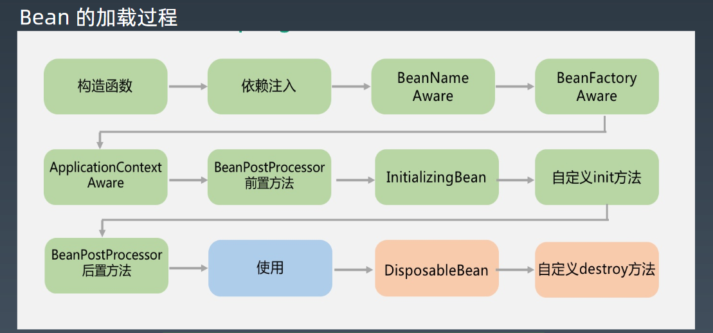
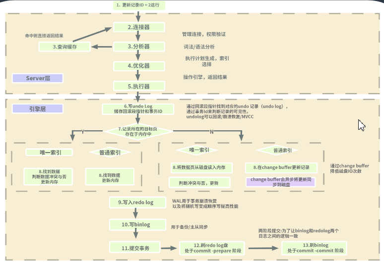

#### jvm

##### 1. JVM 基础知识 

Java 是一种面向对象、静态类型、编译执行，有 VM/GC 和运行时、跨平台的高级语言。

所有的内存生命周期都由 JVM 运行时统一管理。 在绝大部分场景下，你可以非常自由地写代码，而且不用关心内存到底是什么情况。 内存使用有问题的时候，我们可以通过 JVM 来进行信息相关的分析诊断和调整。

##### 2.Java 字节码技术 

什么是字节码？

Java bytecode 由单字节（byte）的指令组成，理论上最多支持 256 个操作码（opcode）。实际上 Java 只使用了200左右的操作码， 还有一些操作码则保留给调试操作。

字节码的运行时结构

字节码的运行时结构JVM 是一台基于栈的计算机器。每个线程都有一个独属于自己的线程栈（JVM Stack），用于存储栈帧（Frame）。每一次方法调用、JVM 都会自动创建一个栈帧。栈帧由操作数栈、 局部变量数组以及一个 Class 引用组成。Class 引用指向当前方法在运行时常量池中对应的 Class

##### 3.JVM 类加载器* 

 类的生命周期

1. 加载（Loading）：找 Class 文件
2. 验证（Verification）：验证格式、依赖
3. 准备（Preparation）：静态字段、方法表
4. 解析（Resolution）：符号解析为引用
5. 初始化（Initialization）：构造器、静态变
  量赋值、静态代码块
6. 使用（Using）
7. 卸载（Unloading）

 三类加载器：

1. 启动类加载器（BootstrapClassLoader）
2. 扩展类加载器（ExtClassLoader）
3. 应用类加载器（AppClassLoader）

加载器特点：

1. 双亲委托
2. 负责依赖
3. 缓存加载

添加引用类的几种方式
1、放到 JDK 的 lib/ext 下，或者 -Djava.ext.dirs
2、 java-cp/classpath 或者 class 文件放到当前路径
3、自定义 ClassLoader 加载
4、拿到当前执行类的 ClassLoader，反射调用 addUrl 方法添加 Jar 或路径（JDK9 无效）

##### 4.JVM 内存模型* 

每个线程都只能访问自己的线程栈。每个线程都不能访问（看不见）其他线程的局部变量。所有原生类型的局部变量都存储在线程栈中，因此对其他线程是不可见的。线程可以将一个原生变量值的副本传给另一个线程，但不能共享原生局部变量本身。堆内存中包含了 Java 代码中创建的所有对象，不管是哪个线程创建的。 其中也涵盖了包装类型（例如 Byte，Integer，Long 等）。不管是创建一个对象并将其赋值给局部变量， 还是赋值给另一个对象的成员变量， 创建的对象都会被保存到堆内存中。

###### JVM内存结构

如果是原生数据类型的局部变量，那么它的内容就全部保留在线程栈上。如果是对象引用，则栈中的局部变量槽位中保存着对象的引用地址，而实际的对象内容保存在堆中。对象的成员变量与对象本身一起存储在堆上, 不管成员变量的类型是原生数值，还是对象引用。类的静态变量则和类定义一样都保存在堆中。

总结一下：方法中使用的原生数据类型和对象引用地址在栈上存储；对象、对象成员与类定义、静态变量在堆上。

堆内存又称为“共享堆”，堆中的所有对象，可以被所有线程访问, 只要他们能拿到对象的引用地址。如果一个线程可以访问某个对象时，也就可以访问该对象的成员变量。如果两个线程同时调用某个对象的同一方法，则它们都可以访问到这个对象的成员变量，但每个线程的局部变量副本是独立的。

每启动一个线程，JVM 就会在栈空间栈分配对应的 线程栈, 线程栈也叫做 Java 方法栈。 如果使用了JNI 方法，则会分配一个单独的本地方法栈(Native Stack)。线程执行过程中，一般会有多个方法组成调用栈（Stack Trace）, 比如 A 调用 B，B 调用 C...每执行到一个方法，就会创建对应的 栈帧（Frame）。

栈帧是一个逻辑上的概念，具体的大小在一个方法编写完成后基本上就能确定。比如返回值需要有一个空间存放，每个局部变量都需要对应的地址空间，此外还有给指令使用的操作数栈，以及 class 指针（标识这个栈帧对应的是哪个类的方法, 指向非堆里面的 Class 对象）。

堆内存是所有线程共用的内存空间，JVM 将Heap 内存分为年轻代（Young generation）和老年代（Old generation, 也叫 Tenured）两部分

年轻代还划分为 3 个内存池，新生代（Eden space）和存活区（Survivor space）, 在大部分GC 算法中有 2 个存活区（S0, S1），在我们可以观察到的任何时刻，S0 和 S1 总有一个是空的, 但一般较小，也不浪费多少空间

Non-Heap 本质上还是 Heap，只是一般不归 GC管理，里面划分为 3 个内存池。

Metaspace, 以前叫持久代（永久代, Permanent generation）, Java8 换了个名字叫 Metaspace。CCS, Compressed Class Space, 存放 class 信息的，和 Metaspace 有交叉。Code Cache存放 JIT 编译器编译后的本地机器代码。

###### 什么是JMM？

所有的对象（包括内部的实例成员变量），static 变量，以及数组，都必须存放到堆内存中。局部变量，方法的形参/入参，异常处理语句的入参不允许在线程之间共享，所以不受内存模型的影响。多个线程同时对一个变量访问时【读取/写入】，这时候只要有某个线程执行的是写操作，那么这种现象就称之为“冲突”。可以被其他线程影响或感知的操作，称为线程间的交互行为， 可分为： 读取、写入、同步操作、外部操作等等。 其中同步操作包括：对 volatile 变量的读写，对管程（monitor）的锁定与解锁，线程的起始操作与结尾操作，线程启动和结束等等。 外部操作则是指对线程执行环境之外的操作，比如停止其他线程等等。JMM 规范的是线程间的交互操作，而不管线程内部对局部变量进行的操作。

##### 5.JVM 启动参数

1. 系统属性参数  

JVM启动参数--系统属性
-Dfile.encoding=UTF-8
-Duser.timezone=GMT+08 
-Dmaven.test.skip=true
-Dio.netty.eventLoopThreads=8

2. 运行模式参数

-server：设置 JVM 使用 server 模式，特点是启动速度比较慢，但运行时性能和内存管理效率很高，适用于生产环境。在具有 64 位能力的 JDK 环境下将默认启用该模式，而忽略 -client 参数。

-client ：JDK1.7 之前在32位的 x86 机器上的默认值是 -client 选项。设置 JVM 使用 client 模式，特点是启动速度比较快，但运行时性能和内存管理效率不高，通常用于客户端应用程序或者 PC 应用开发和调试。此外，我们知道 JVM 加载字节码后，可以解释执行，也可以编译成本地代码再执行，所以可以配置 JVM 对字节码的处理模式。

-Xint：在解释模式（interpreted mode）下运行，-Xint 标记会强制 JVM 解释执行所有的字节码，这当然会降低运行速度，通常低10倍或更多。

-Xcomp：-Xcomp 参数与-Xint 正好相反，JVM 在第一次使用时会把所有的字节码编译成本地代码，从而带来最大程度的优化。【注意预热】

-Xmixed：-Xmixed 是混合模式，将解释模式和编译模式进行混合使用，有 JVM 自己决定，这是 JVM 的默认模式，也是推荐模式。 我们使用 java -version 可以看到 mixed mode 等信息

3. 堆内存设置参数

-Xmx, 指定最大堆内存。 如 -Xmx4g。这只是限制了 Heap 部分的最大值为4g。这个内存不包括栈内存，也不包括堆外使用的内存。
-Xms, 指定堆内存空间的初始大小。 如 -Xms4g。 而且指定的内存大小，并不是操作系统实际分配的初始值，而是GC先规划好，用到才分配。 专用服务器上需要保持 –Xms 和 –Xmx 一致，否则应用刚启动可能就有好几个 FullGC。当两者配置不一致时，堆内存扩容可能会导致性能抖动。
-Xmn, 等价于 -XX:NewSize，使用 G1 垃圾收集器 不应该 设置该选项，在其他的某些业务场景下可以设置。官方建议设置为 -Xmx 的 1/2 ~ ¼。
-XX：MaxPermSize=size, 这是 JDK1.7 之前使用的。Java8 默认允许的Meta空间无限大，此参数无效。
-XX：MaxMetaspaceSize=size, Java8 默认不限制 Meta 空间，一般不允许设置该选项。
-XX：MaxDirectMemorySize=size，系统可以使用的最大堆外内存，这个参数跟 -Dsun.nio.MaxDirectMemorySize 效果相同。
-Xss, 设置每个线程栈的字节数，影响栈的深度。 例如 -Xss1m 指定线程栈为1MB，与-XX:ThreadStackSize=1m 等价。

4. GC 设置参数

-XX：+UseG1GC：使用 G1 垃圾回收器
-XX：+UseConcMarkSweepGC：使用 CMS 垃圾回收器
-XX：+UseSerialGC：使用串行垃圾回收器
-XX：+UseParallelGC：使用并行垃圾回收器
// Java 11+
-XX：+UnlockExperimentalVMOptions -XX:+UseZGC 
// Java 12+
-XX：+UnlockExperimentalVMOptions -XX:+UseShenandoahGC

5. 分析诊断参数

-XX：+-HeapDumpOnOutOfMemoryError 选项，当 OutOfMemoryError 产生，即内存溢出（堆内存或持久代)时，自动 Dump 堆内存。示例用法： java -XX:+HeapDumpOnOutOfMemoryError -Xmx256m ConsumeHeap
-XX：HeapDumpPath 选项，与 HeapDumpOnOutOfMemoryError 搭配使用，指定内存溢出时 Dump 文件的目录。
如果没有指定则默认为启动 Java 程序的工作目录。
示例用法： java -XX:+HeapDumpOnOutOfMemoryError -XX:HeapDumpPath=/usr/local/ ConsumeHeap 自动 Dump 的 hprof 文件会存储到 /usr/local/ 目录下。
-XX：OnError 选项，发生致命错误时（fatal error）执行的脚本。例如, 写一个脚本来记录出错时间, 执行一些命令，或者 curl 一下某个在线报警的 url。
-XX：OnOutOfMemoryError 选项，抛出 OutOfMemoryError 错误时执行的脚本。
-XX：ErrorFile=filename 选项，致命错误的日志文件名,绝对路径或者相对路径。

6. JavaAgent 参数

Agent 是 JVM 中的一项黑科技，可以通过无侵入方式来做很多事情，比如注入 AOP 代码，执行统
计等等，权限非常大。这里简单介绍一下配置选项，详细功能需要专门来讲。
设置 agent 的语法如下：
-agentlib:libname[=options] 启用 native 方式的 agent，参考 LD_LIBRARY_PATH 路径。
-agentpath:pathname[=options] 启用 native 方式的 agent。
-javaagent:jarpath[=options] 启用外部的 agent 库，比如 pinpoint.jar 等等。
-Xnoagent 则是禁用所有 agent。

#### nio

阻塞式 IO、BIO

一般通过在 while(true) 循环中服务端会调用 accept() 方法等待接收客户端的连接的方式监听请求，请求一旦接收到一个连接请求，就可以建立通信套接字在这个通信套接字上进行读写操作，此时不能再接收其他客户端连接请求，只能等待同当前连接的客户端的操作执行完成， 不过可以通过多线程来支持多个客户端的连接。

非阻塞式 IO

和阻塞 IO 类比，内核会立即返回，返回后获得足够的 CPU 时间继续做其它的事情。用户进程第一个阶段不是阻塞的,需要不断的主动询问 kernel 数据好了没有；第二个阶段依然总是阻塞的

IO多路复用

IO 多路复用(IO multiplexing)，也称事件驱动 IO(event-driven IO)，就是在单个线程里同时监控多个套接字，通过 select 或poll 轮询所负责的所有 socket，当某个socket 有数据到达了，就通知用户进程。IO 复用同非阻塞 IO 本质一样，不过利用了新的 select 系统调用，由内核来负责本来是请求进程该做的轮询操作。看似比非阻塞 IO 还多了一个系统调用开销，不过因为可以支持多路 IO，才算提高了效率。进程先是阻塞在 select/poll 上，再是阻
塞在读操作的第二个阶段上。

select/poll的几大缺点：
（1）每次调用 select，都需要把 fd 集合从用户态拷贝到内核态，这个开销在 fd 很多时会很大
（2）同时每次调用 select 都需要在内核遍历传递进来的所有 fd，这个开销在 fd 很多时也很大
（3）select 支持的文件描述符数量太小了，默认是1024

epoll（Linux 2.5.44内核中引入,2.6内核正式引入,可被用于代替 POSIX select 和 poll 系统调用）：
（1）内核与用户空间共享一块内存
（2）通过回调解决遍历问题
（3）fd 没有限制，可以支撑10万连接

信号驱动 I/O
信号驱动 IO 与 BIO 和 NIO 最大的区别就在于，在 IO 执行的数据准备阶段，不需要轮询。

异步式 IO
异步 IO 真正实现了 IO 全流程的非阻塞。用户进程发出系统调用后立即返回，内核等待数据准备完成，然后将数据拷贝到用户进程缓冲区，然后发送信号告诉用户进程 IO 操作执行完毕（与 SIGIO 相比，一个是发送信号告诉用户进程数据准备完毕，一个是 IO执行完毕） 

#### 并发编程

并发：同时拥有两个或者多个线程，如果程序在单核处理器上运行，多个线程将交替的换入或者换出内存，这些线程是同时“存在”的，每个线程都处于执行过程中的某个状态，如果运行在多核处理器上，此时，程序中每个线程都将分配到一个处理器核上，因此，可以同时运行。

并发是多个线程操作相同资源，保证线程安全，合理使用资源

并发包使用

锁机制类 Locks : Lock, Condition, ReentrantLock, ReadWriteLock,LockSupport
原子操作类 Atomic : AtomicInteger, AtomicLong, LongAdder
线程池相关类 Executor : Future, Callable, Executor, ExecutorService
信号量三组工具类 Tools : CountDownLatch, CyclicBarrier, Semaphore
并发集合类 Collections : CopyOnWriteArrayList, ConcurrentMap

synchronized 方式的问题：
1、同步块的阻塞无法中断（不能 Interruptibly）
2、同步块的阻塞无法控制超时（无法自动解锁）
3、同步块无法异步处理锁（即不能立即知道是否可以拿到锁）
4、同步块无法根据条件灵活的加锁解锁（即只能跟同步块范围一致）

用锁的最佳实践

1. 永远只在更新对象的成员变量时加锁
2. 永远只在访问可变的成员变量时加锁
3. 永远不在调用其他对象的方法时加锁

1、降低锁范围：锁定代码的范围/作用域
2、细分锁粒度：讲一个大锁，拆分成多个小锁

并发原子类

无锁技术 – Atomic 工具类

无锁技术的底层实现原理
•Unsafe API - CompareAndSwap
•CPU 硬件指令支持 - CAS 指令
•Value 的可见性 - volatile 关键字

核心实现原理：
1、volatile 保证读写操作都可见（注意不保证原子）；
2、使用 CAS 指令，作为乐观锁实现，通过自旋重试保证写入。

CAS 本质上没有使用锁。并发压力跟锁性能的关系：
1、压力非常小，性能本身要求就不高；
2、压力一般的情况下，无锁更快，大部分都一次写入；
3、压力非常大时，自旋导致重试过多，资源消耗很大。

并发工具类

AQS
•AbstractQueuedSynchronizer，即队列同步器。它是构建锁或者其他同步组件的基础（如 Semaphore、CountDownLatch、ReentrantLock、ReentrantReadWriteLock），是 JUC 并发包中的核心基础组件，抽象了竞争的资源和线程队列。

AbstractQueuedSynchronizer：抽象队列式的同步器•两种资源共享方式:  独占 | 共享，子类负责实现公平 OR 非公平

#### Spring 和 ORM 等框架

Spring 是一个**轻量级的 DI / IoC 和 AOP 容器的开源框架**，它的理念包括 **IoC (Inversion of Control，控制反转)** 和 **AOP(Aspect Oriented Programming，面向切面编程)**。提倡以**“最少侵入”**的方式来管理应用中的代码。使用spring框架可以简化开发

AOP-面向切面编程
Spring早期版本的核心功能: 管理对象生命周期与对象装配。为了实现管理和装配，一个自然而然的想法就是，加一个中间层代理（字节码增强）来实现所有对象的托管。
IoC-控制反转
也称为DI（Dependency Injection）依赖注入。对象装配思路的改进。从对象A直接引用和操作对象B，变成对象A里指需要依赖一个接口IB，系统启动和装配阶段，把IB接口的实例对象注入到对象A，这样A就不需要依赖一个IB接口的具体实现，也就是类B。

**Spring Bean 生命周期**

1）实例化Bean实例，设置对象属性，检查 Aware的相关接口并设置相关依赖 
2）前置处理、After 处理
3）调用 init method
4）后置处理

5）销毁（注册Destruction相关回调接口，是否实现DisposableBean接口，是否配置自定义的destory-method）

 什么是ORM?

对象-关系映射（Object-Relational Mapping，简称ORM），面向对象的开发方法是当今企业级应用开发环境中的主流开发方法，关系数据库是企业级应用环境中永久存放数据的主流数据存储系统。对象和关系数据是业务实体的两种表现形式，业务实体在内存中表现为对象，在数据库中表现为关系数据。内存中的对象之间存在关联和继承关系，而在数据库中，关系数据无法直接表达多对多关联和继承关系。因此，对象-关系映射(ORM)系统一般以中间件的形式存在，主要实现程序对象到关系数据库数据的映射。

#### MySQL 数据库和 SQL

SQL 语言

结构化查询语言包含6个部分：
1、数据查询语言（DQL: Data Query Language）：其语句，也称为“数据检索语句”，用以从表中获得数据，确
定数据怎样在应用程序给出。保留字SELECT 是DQL（也是所有SQL）用得最多的动词，其他DQL 常用的保留字
有WHERE，ORDER BY，GROUP BY 和HAVING。这些DQL 保留字常与其它类型的SQL 语句一起使用。
2、数据操作语言（DML：Data Manipulation Language）：其语句包括动词INSERT、UPDATE 和DELETE。它
们分别用于添加、修改和删除。
3、事务控制语言（TCL）：它的语句能确保被DML 语句影响的表的所有行及时得以更新。包括COMMIT（提交）
命令、SAVEPOINT（保存点）命令、ROLLBACK（回滚）命令。
4、数据控制语言（DCL）：它的语句通过GRANT 或REVOKE 实现权限控制，确定单个用户和用户组对数据库对象
的访问。某些RDBMS 可用GRANT 或REVOKE 控制对表单个列的访问。
5、数据定义语言（DDL）：其语句包括动词CREATE,ALTER 和DROP。在数据库中创建新表或修改、删除表
（CREAT TABLE 或DROP TABLE）；为表加入索引等。
6、指针控制语言（CCL）：它的语句，像DECLARE CURSOR，FETCH INTO 和UPDATE WHERE CURRENT 用于对
一个或多个表单独行的操作。

**mysql详细执行流程**

**MySQL 配置优化**

查看参数配置

- show variables like xxx

1）连接请求的变量
1、max_connections
2、back_log
3、wait_timeout和interative_timeout

2）缓冲区变量
4、key_buffer_size
5、query_cache_size（查询缓存简称QC)
6、max_connect_errors
7、sort_buffer_size
8、max_allowed_packet=32M
9、join_buffer_size=2M
10、thread_cache_size=300

3）配置Innodb 的几个变量
11、innodb_buffer_pool_size=128M
12、innodb_flush_log_at_trx_commit
13、innodb_thread_concurrency=0
14、innodb_log_buffer_size
15、innodb_log_file_size=50M
16、innodb_log_files_in_group=3
17、read_buffer_size=1M
18、read_rnd_buffer_size=16M
19、bulk_insert_buffer_size=64M
20、binary log

**mysql事务**

事务可靠性模型 ACID:
•Atomicity: 原子性，一次事务中的操作要么全部成功，要么全部失败。
•Consistency: 一致性，跨表、跨行、跨事务，数据库始终保持一致状态。
•Isolation: 隔离性，可见性，保护事务不会互相干扰，包含4种隔离级别。
•Durability: 持久性，事务提交成功后，不会丢数据。如电源故障，系统崩溃

表级锁
意向锁: 表明事务稍后要进行哪种类型的锁定
•共享意向锁（IS）: 打算在某些行上设置共享锁
•排他意向锁（IX）: 打算对某些行设置排他锁
•Insert 意向锁: Insert 操作设置的间隙锁

行级锁（InnoDB)
•记录锁（Record）: 始终锁定索引记录，注意隐藏的聚簇索引
•间隙锁（Gap）: 锁住一个范围
•临键锁（Next-Key）:  记录锁+间隙锁的组合; 可“锁定”表中不存在记录
•谓词锁（Predicat）: 空间索引

**读已提交: READ COMMITTE**  可能的问题:  幻读、不可重复读

锁定索引记录,  而不锁定记录之间的间隙

不可重复读: 不加锁的情况下, 其他事务 UPDATE 或 DELETE 会对查询结果有影响
幻读: 加锁后, 不锁定间隙，其他事务可以 INSERT

**可重复读: REPEATABLE READ** InnoDB 的默认隔离级别

其他查询条件，会锁定扫描到的索引范围，通过间隙锁或临键锁来阻止其他会话在这
个范围中插入值。

可能的问题:  InnoDB 不能保证没有幻读，需要加锁

**串行化: SERIALIZABLE**

undo log: 撤消日志
•保证事务的原子性
•用处: 事务回滚, 一致性读、崩溃恢复。

redo log: 重做日志
•确保事务的持久性，防止事务提交后数据未刷新到磁盘就掉电或崩溃。
•事务执行过程中写入 redo log，记录事务对数据页做了哪些修改。